# **Class 01 Developer Payne's First Adventure**

## **Section Selector**:
  - [**Food For Thought**](#food-for-thought)
  - [**Text**](#text)
  - [**Introducing CSS**](#introducing-css)
  - [**Basic JavaScript Instructions**](#basic-javascript-instructions)
  - [**Decisions and Loops**](#decisions-and-loops)
  - [**Table of Contents**](#code-201-reading-notes)

---

## **Food For Thought**
- Submit something vs nothing
- Cascading Style Sheets = CSS
- One H1 in a page
- function call is the name of ()
- selector, declaration names for the outside the curly braces and inside stuff
- <link\> doesn't need a closing tag 
- 

---

## **Text**
Structural Markup: Elements that you use to describe both heading and paragraphs  
Semantic Markup: provides extra info such as where emphasis is placed in a sentence  
HTML has six levels of headings h1 - h6  
<p\> is used to create a paragraph  
<b\> is used to bold  
<i\> is used to italic   
<sup\> element is used to contain characters   
<sub\> is used to contain characters that should be subscript   
white space is used to make code easier to read   
  used to make a manual line break   
<hr\> used to create a break between themes   
<strong\> indicates that its content has strong importance   
<em\> indicates emphasis that subtly changes the meaning  
<blockquote\> element is used for longer quotes  
<q\> is used for shorter quotes   
<abbr\> is used for abbreviation or an acronym   
<cite\> can be used to indicate where the citation is from   
<dfn\> is used to indicate the defining instance of a new term   
<address\> element has a quite specific use to contain   
<ins\> used to show content that has been inserted   
<del\> used to show text that has been deleted   
<s\> will usually do a strike through   

## **Key Takeaways**
- HTML elements are used to describe the structure of the page (e.g. headings, subheadings, paragraphs).
- They also provide semantic information (e.g. where emphasis should be placed, the definition of any acronyms used, when given text is a quotation). 

---

## **Introducing CSS**

### **CSS Rules for Days**
+ CSS associates style rules with html elements
+ A CSS rule has two parts **Selector** and **Declaration**
+ **Selector**: indicates which element the rule applies to
+ **Declarations**: indicate how the elements refereed to in the selector should be styled 
+ Declarations have two parts a property and a value that are separated by a colon :  

### **CSS Brace the Elements**
+ CSS properties affect how elements are displayed 
+ CSS declarations sit inside curly brackets and have two parts a **property** and a **value** multiple properties can be specified in on declaration when separated by a semi colon :
+ **Properties**: indicate the aspects of the element you want to change
+ **Values** Specify the settings you want to use for that chosen properties  
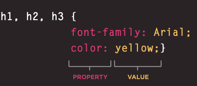  

### **Internal CSS**
+ **<style\>** is the tag to place an element in for an internal CSS 
+ It should be placed inside the <head\> 
+ It should use the the type of attribute to indicate that the styles are specified in the CSS 
+ If your building a site with more than one page you should use a external CSS style sheet
+ This will allow all the pages to use the same rules rather than having to duplicate them each time
+ Changing the one sheet will change all other linked pages  
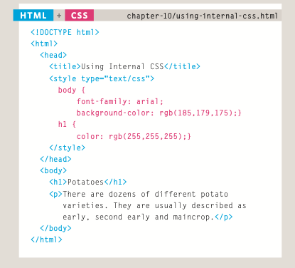  

### **CSS Selectors**
+ CSS selectors are case sensitive so they must match element names and attribute values exactly
+ More advanced selectors than the ones below will be taught as we go on  
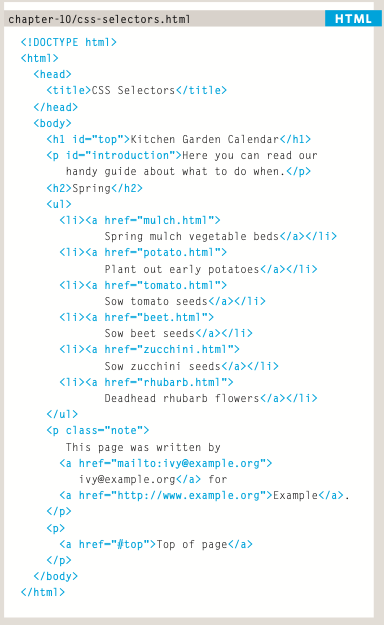  
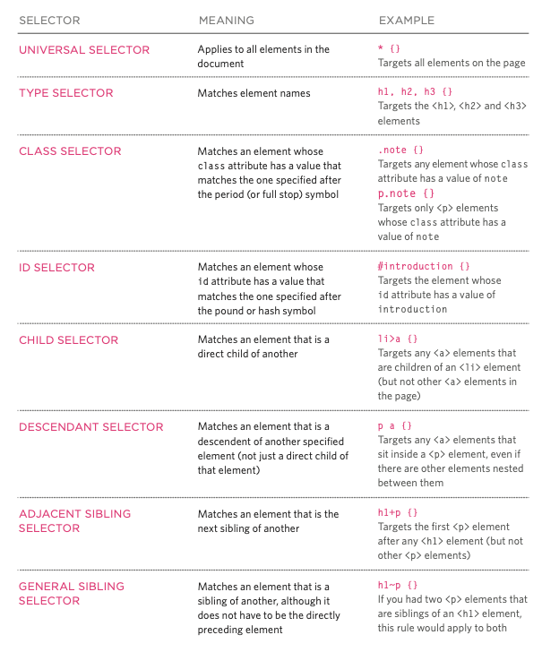  

### **I choose....CSS CASCADE**
+ If two selectors are identical the last rule will take precedence
+ Two selectors of the same kind picked the more specific one will take precedence over the general ones
+ You can add important after any property value to indicate that it should be considered more important than other rules that apply to the same element
+ Understanding how CSS rules cascade means you can write simpler style sheets because you can create generic rules that apply to most elements and then override the properties on individual elements that need to appear differently

### **Grandma left me waht?? A  CSS Inheritance**
+ If you specify the font-family or color properties on the <body\> element, they will apply to most child elements. This is because the value of the font-family property is inherited by child elements. It saves you from having to apply these properties to as many elements (and results in simpler style sheets)  
+ You can force a lot of properties to inherit values from their parent elements by using inherit for the value of the properties. In this example, the <div\> element with a class called page inherits the padding size from the CSS rule that applies to the <body\> element  

## **Key Takeaways**
* CSS treats each HTML element as if it appears inside its own box and uses rules to indicate how that element should look  
* Rules are made up of selectors (that specify the elements the rule applies to) and declarations (that indicate what these elements should look like)  
* Different types of selectors allow you to target your rules at different elements  
* Declarations are made up of two parts: the properties of the element that you want to change, and the values of those properties. For example, the font-family property sets the choice of font, and the value arial specifies Arial as the preferred typeface  
* CSS rules usually appear in a separate document, although they may appear within an HTML page 

---

## **Basic JavaScript Instructions**

## **Captain JavaScript has.....Basic JS Instructions**

### **I have a Statement from Captain JavaScript..**;
+ A script is a series of instructions that your computer follows one by one
+ Each individual instruction is know as a **Statement** 
+ Statements should end with a semicolon ;  
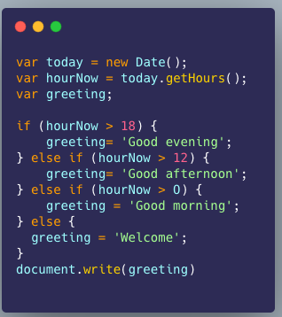
+ Lines 1-3 6,8,,10,12,& 14 are all statements
+ These {\} braces indicate the start and end of a code block. Each code block could contain many more statements 
+ Lines 5,7,9,11 determines which code should be run
+ Javascript is case sensitive hourNow and hournow are different 
+ Statements are instructions and each one starts on a new one and ends with a semicolon ;
+ This formatting makes your code easier to read
+ The semicolon tells the JS interpreter when a step is over and when it should move to the next one 
+ Statements cane be organized into code blocks 
+ statements can be surrounded by curley braces {\} this is a code block 
+ The closing curly brace is not followed by a semicolon ;
+ Code blocks will often be used to group together many more statements
+ This makes your code organized and more readable remember your code should be able to be read by anyone that understand JS HTML and CSS after this 

### **Conqueror of the Supreme Comments**
+ Write comments to explain what your code does. it makes it easier to read and understand and can help you and other who read it down the road
+ Multi-line comments are written by starting the line with /* and ends with */ anything written inside of that is not processed by the JS interpreter
+ Normally they are used for descriptions of how the script works or to prevent a section of the script from running when testing it   
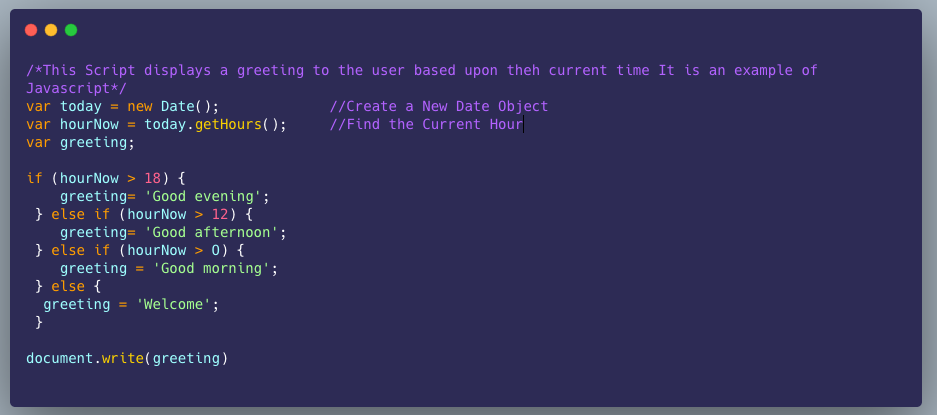  

### **Variable Vinsmoke Appears**
+ A script will have to temporarily store the bits of information it needs to do its job. It can store this data in variables
+ When you write JavaScript, you have to tell the interpreter every individual step that you want it to perform. This sometimes involves more detail than you might expect
+ You can compare variables to short-term memory, because once you leave the page, the browser will forget any information it holds
+ A variable is a good name for this concept because the data stored in a variable can change (or vary) each time a script runs
+ variables can be used to represent values in your scripts that are likely to change. The result is said to be **calculated** or **computed** using the data stored in the variables
+ The use of variables to represent numbers or other kinds of data is very similar to the concept of algebra (where letters are used to represent numbers\). The equals sign does something very different in programming 

### **Variable Vinsmoke will you declare them?**
+ Before you can use a variable you need to announce that you want to use it
+ This involves creating the variable then giving it a name normally you say that you declare the variable   
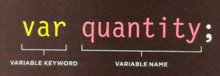   
+ Var in the above example is what a programmer calls a keyword the JS interpreter knows that this keyword is used to create a variable
+ Before you can use the variable you gotta name it sometimes called an identifier the variable in the above example is called quantity
+ if the variable name is more than one word it is usually written in camelCase
+ CamelCase means the first word is all lowercase and any subsequent words have their first letter capitalized

### **Variable Vinsmoke Assign them a Value**
+ Once a variable is created you can tell it what info you would like it to store. 
+ Normally you would say you assign a value to the variable   
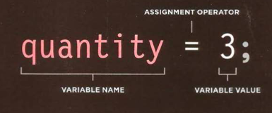  
+ Huzzah that variable is now usable by name
+ In the above example quantity that we created earlier is now set to 3
+ Variable's names should describe the kind of data that variable hold
+ The equals sign = is an assignment operator it says that you age going to assign a value to the variable 
+ It is also used to update the value given to a variable  
+ Util a value is assigned it is generally called undefined 
+ Where a variable is declared can have an effect upon whether the rest of the script can use it
+ Often this is called the scope of a variable 

### **Dr Data Types Steps on the Scene** 
+ JavaScript distinguishes between numbers, strings, and true or false values known as Booleans
+ **NUMERIC DATA TYPE**: The numeric data type handles numbers **ex: 0.75**
+ **STRING DATA TYPE**: The strings data type consists of letters and other characters **ex: 'Hi, Ivy!'**
+ Note how the string data type is enclosed within a pair of quotes. These can be single or double quotes, but the opening quote must match the closing quote
+ Strings can be used when working with any kind of text. They are frequently used to add new content into a page and they can contain HTML markup
+ **BOOLEAN DATA TYPE**: Boolean data types can have one of two values: true or false it is generally on or off for this data type **ex: true**
+ In addition to these three data types, JavaScript also has others (arrays, objects, undefined, and null\)
+ Unlike some other programming languages, when declaring a variable in JavaScript, you do not need to specify what type of data it will hold

### **Variable Vinsmoke try to store a number**  
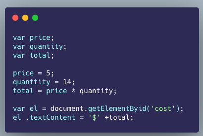   
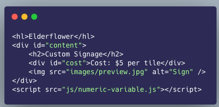    
+ Here, three variables are created and values are assigned to them.  
+ price holds the price of an individual tile  
+ quantity holds the number of tiles a customer wants  
+ total holds the total cost of the tiles  
+ Note that the numbers are not written inside quotation marks. Once a value has been assigned to a variable, you can use the variable name to represent that value
+ Here, the total cost is calculated by multiplying the price of a single tile by the number of tiles the customer wants
+ The result is then written into the page on the final two lines. You see this technique in more detail on 
The first of these two lines finds the element whose id attribute has a value of cost, and the final line replaces the content of that element with new content
+ There are many ways to write content into a page, and several places you can place your script

### **Variable Vinsmoke try to store a string**  
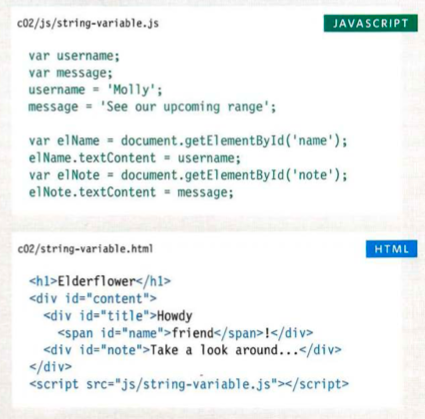  
+ Two variables are declared in the above example username & message and they and used for the above strings 'Molly' & 'See our upcoming range'
+ Note how the string is placed inside quote marks
+ The quotes can be single or double quotes, but they must match
+ Quotes should be straight (not curly) quotes
+ Strings must always be written on one line

### **Variable Vinsmoke try to using quotes inside a string**
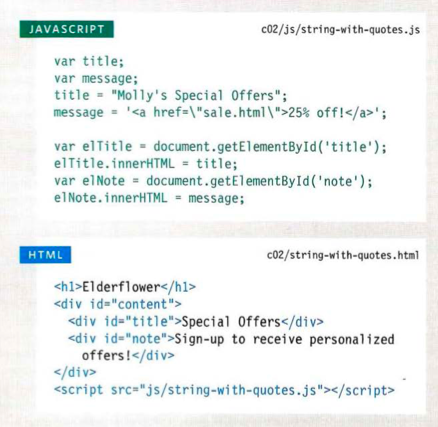   
+ Sometimes you will want to use a double or single quote mark within a string
+ Because strings can live in single or double quotes, if you just want to use double quotes in the string, you could surround the entire string in single quotes
+ If you just want to use single quotes in the string, you could surround the string in double quotes (as shown in the third line of the above example)
+ You can also use a technique called escaping the quotation characters. This is done by using a backwards slash (or "backslash") before any type of quote mark that appears within a string (as shown on the fourth line of this code sample).
+ The backwards slash tells the interpreter that the following character is part of the string, rather than the end of it.

### **Variable Vinsmoke try to store a boolean**
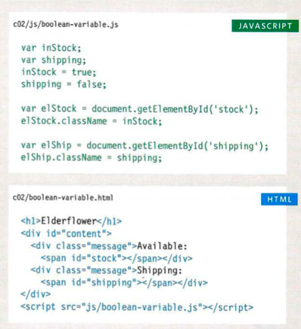  
+ A Boolean variable can only have a value of true or fa1se
+ It is rare that you would want to write the words true or false into the page for the user to read, but this data type does have two very popular uses
+ Booleans are used when the value can only be true/ fa1se
+ Second, Booleans are used when your code can take more than one path. Remember, different code may run in different circumstances

### **Variable Vinsmoke time to learn some shorthand**
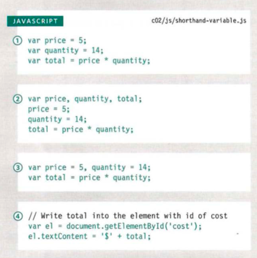  
+ Variables are declared and values assigned in the same statement
+ Three variables are declared on the same line, then values assigned to each
+ Two variables are declared and assigned values on the same line. Then one is declared and assigned a value on the next line
+ The third example shows two numbers, but you can declare variables that hold different types of data on the same line, e.g., a string and a number
+ Here, a variable is used to hold a reference to an element in the HTML page

### **Variable Vinsmoke change your Value**
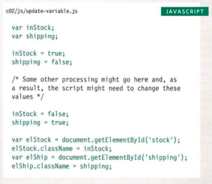  
+ Once you have assigned a value to a variable, you can then change what is stored in the variable later in the same script
+ Once the variable has been created, you do not need to use the var keyword to assign it a new value. You just use the variable name, the equals sign (al so known as t he assignment operator), and the new value for that attribute

### **Variable Vinsmoke what is your name**
+ There are six rules you must follow when giving a variable a name
  1. The name must begin with a letter, dollar sign ($),or an underscore (_). It must not start with a number
  2. The name can contain letters, numbers, dollar sign ($), or an underscore (_). Note that you must not use a dash(-) or a period (.) in a variable name
  3. You cannot use keywords or reserved words. Keywords are special words that tell the interpreter to do something. For example, var is a keyword used to declare a variable. Reserved words are ones that may be used in a future version of JavaScript [cheatsheet](https://docs.oracle.com/javase/tutorial/java/nutsandbolts/_keywords.html)
  4. All variables are case sensitive, so score and Score would be different variable names, but it is bad practice to create two variables that have the same name using different cases 
  5. Use a name that describes the kind of information that the variable stores. For example, firstName might be used to store a person's first name, lastName for their last name, and age for their age
  6. If your variable name is made up of more than one word, use a capital letter for the first letter of every word after the first word. For example, firstName rather than firstname

## **Key Takeaways**
* CSS treats each HTML element as if it appears inside its own box and uses rules to indicate how that element should look  
* Rules are made up of selectors (that specify the elements the rule applies to) and declarations (that indicate what these elements should look like)  
* Different types of selectors allow you to target your rules at different elements  
* Declarations are made up of two parts: the properties of the element that you want to change, and the values of those properties. For example, the font-family property sets the choice of font, and the value arial specifies Arial as the preferred typeface  
* CSS rules usually appear in a separate document, although they may appear within an HTML page 

---

## **Decisions and Loops** 
Evaluation: you analyze the value in your script to determine whether or note they match expected results 
Decisions: 
### **Yonko JavaScript, Marine Comparison Operator is trying to Evaluate our ships Conditions**
+ You can evavalute a situation by comparing one value in the script to what you expect it might be
+  This result would be called a Boolean: True or False
+  **==**: Is equal to this **operator** compares two values(numbers, strings, or Booleans) to see if they are the same
+ **'Hello' == 'Goodbye'**: returns false because they are not the same string
+ **'Hello' == 'Goodbye'**: returns turns because they are the same 
+ it is generally preferred to use the strict method below
+ **===**: Strict equal to this operator compares two values to check that both the dat type and value are the same
+ **'3'===3**: returns false because they are not the same data type or value
+ **'3'==='3'**: Returns true because they are the same data type and value
+ **!=**: Is not equal to this operator compares two values: **(numbers, strings or booleans\) to see if they are not the same
+ **'Hello' != 'Goodbye'**: returns true because they are not the same string
+ **'Hello' != 'Hello'**: returns false because they are the same string
+ Again the strict method below is the preferred method
+ **!==**:Strict not equal to this operator compares two values to check that both the date type and value are not the same
+ **"3' !== 3**: returns true because they are not the same
+ **'3" !== '3'**: returns false because they are the same data type and value
+ Programmers often refer to testing or checking of a condition as evaluating the condition
+ Exceptions
  1. Every value can be treated as true or false even if it is not a boolean true or false
  2. in short circuit evaluation a condition might not need to run
+ **>**: Greater Than this operator check if the number on the left is greater than the number on the right
+ **>=**: greater than or equal to this operator checks if the number on the left is greater than or equal to the number on the right
+ **<**: Less than this operator checks if the number on the left is less than the number on the right
+ **<=**: less than or equal to this operator checks if the number on the left is less than or equal to the number on the right

### **Yonko JavaScript, The Marine Admiral Logical Operators appears**
+ Comparison operators usually return single values of true or false Logical operators allow you to compare the results of more than one comparison operator  
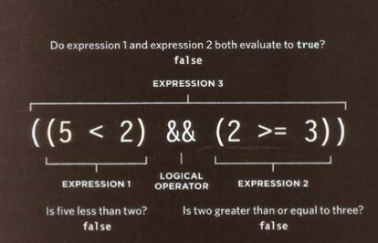  
+ in the above line of code 3 expressions are written
+ the left and the right both use comparison operators and both return false
+ The 3rd uses a logical operator different than a comparison operator
+ This logical AND operator checks to see whether both expressions on either side of it return true 
+ **&&**: Logical AND this operator tests more than one condition  
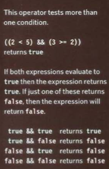  
+ **||**: Logical OR This operator tests at least one condition  
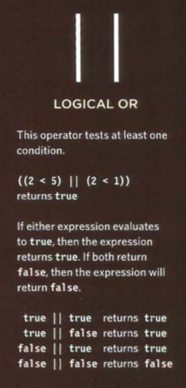  
**!**: Logical Not this operator takes a single boolean value and invert it  
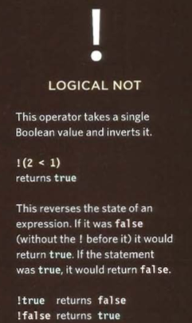)  
+ Logical expressions are evaluated left to right
+ if the first condition can provide enough information to get the answer then there is no need to evaluate the second condition
## **Key Takeaways**

---

## [**Code 201 Reading Notes**](/201/201homepage.md)
  1. [Class 00](/201/class-01.md)
  2. [Class 01](/201/class-02.md)
  3. Day 02
  4. Day 03
  5. Day 04
  6. Day 05
  7. Day 06
  8. Day 07
  9. Day 08
  10. Day 09
  11. Day 10
  12. Day 11
  13. Day 12
  14. Day 13
  15. Day 14
<!-- DrP E-Sign Up, Up, Down, Down, Left, Right, Left, Right, B, A, Start -->