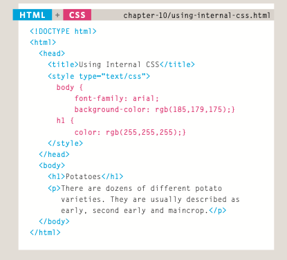
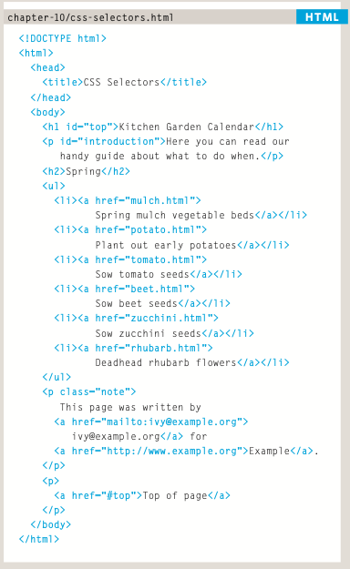
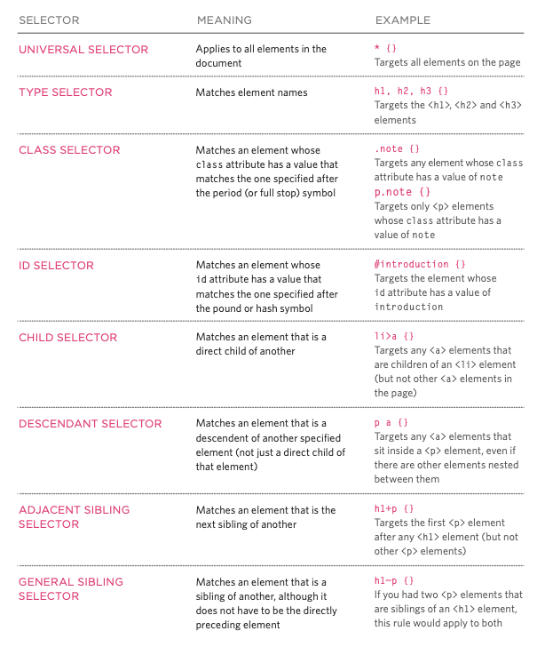

# **The Devil Wears CSS**

## **Food For Thought**
+ It is generally considered good practice to have the content of the site separated from the rules that determine how it appears  
+ You do not need lots of computers to test your site, as there are online tools to show you what a page looks like in multiple browsers:
    1. [BrowserCam](https://www.browsercam.com/)  
    2. [CrossBrowserTesting](https://crossbrowsertesting.com/) 
+ class=: can have multiple targets
+ id=: can only have one target

## **CSS Rules for Days**
+ CSS associates style rules with html elements
+ A CSS rule has two parts **Selector** and **Declaration**
+ **Selector**: indicates which element the rule applies to
+ **Declarations**: indicate how the elements refereed to in the selector should be styled 
+ Declarations have two parts a property and a value that are separated by a colon :  

# **CSS Brace the Elements**
+ CSS properties affect how elements are displayed 
+ CSS declarations sit inside curly brackets and have two parts a **property** and a **value** multiple properties can be specified in on declaration when separated by a semi colon :
+ **Properties**: indicate the aspects of the element you want to change
+ **Values** Specify the settings you want to use for that chosen properties  

## **External CSS**
+ **<link\>**: is the element uses in an html doc to tell the browsers where to find the CSS file used to style the page don't forget it is empty so it doesn't need a closing tag
+ **href**: specifies the path to the css file often put in a css or styles folder
+ **type**:: specifies the type of document being linked to normally a text/css
+ **rel**: specifies the relationship between the HTML page and the file it is linked to this should be a stylesheet when linking to a scss file
+ You can have more than one CSS style sheet you can do this by having a <link\> element for every css file  

## **Internal CSS**
+ **<style\>** is the tag to place an element in for an internal CSS 
+ It should be placed inside the <head\> 
+ It should use the the type of attribute to indicate that the styles are specified in the CSS 
+ If your building a site with more than one page you should use a external CSS style sheet
+ This will allow all the pages to use the same rules rather than having to duplicate them each time
+ Changing the one sheet will change all other linked pages  

## **CSS Selectors**
+ CSS selectors are case sensitive so they must match element names and attribute values exactly
+ More advanced selectors than the ones below will be taught as we go on  
  
  

## **I choose....CSS CASCADE**
+ If two selectors are identical the last rule will take precedence
+ Two selectors of the same kind picked the more specific one will take precedence over the general ones
+ You can add important after any property value to indicate that it should be considered more important than other rules that apply to the same element
+ Understanding how CSS rules cascade means you can write simpler style sheets because you can create generic rules that apply to most elements and then override the properties on individual elements that need to appear differently

## **Grandma left me waht?? A  CSS Inheritance**
+ If you specify the font-family or color properties on the <body\> element, they will apply to most child elements. This is because the value of the font-family property is inherited by child elements. It saves you from having to apply these properties to as many elements (and results in simpler style sheets)  
+ You can force a lot of properties to inherit values from their parent elements by using inherit for the value of the properties. In this example, the <div\> element with a class called page inherits the padding size from the CSS rule that applies to the <body\> element  

# **Summary**
* CSS treats each HTML element as if it appears inside its own box and uses rules to indicate how that element should look  
* Rules are made up of selectors (that specify the elements the rule applies to) and declarations (that indicate what these elements should look like)  
* Different types of selectors allow you to target your rules at different elements  
* Declarations are made up of two parts: the properties of the element that you want to change, and the values of those properties. For example, the font-family property sets the choice of font, and the value arial specifies Arial as the preferred typeface  
* CSS rules usually appear in a separate document, although they may appear within an HTML page  

# **Fun With Colors**

## **Color in the lines**
* color: Specify the color of text inside the tag
* 3 types of ways to write the color value
* RGB Values: express colors in terms of how much red, green and blue ex:(100,100,90)
* Hex Codes: six digit codes that represent the amount of red green and blue preceded by a pound or hash
* Color names: 147 predefined color names that are recognized
* You can use * & * at the start and end in css to add a comment  

## **Color outside the lines**
+ background-color: is the code to change this value
+ Css treats each HTMl element as if it appears in a box and background-color property sets that color
+ The same 3 values for color can be used for background color
+ if not background is listed it will be transparent 
+ must browsers have white as default but be careful to not assume and check that before you submit something
+ padding is used to separate the text from the edges of the box  

## **What is Color** 
+ Every color on a computer screen is created by mixing amounts of red, green, and blue  

## **Gotta Get the Contrast**
+ When Picking foreground and background colors it is important to 
  ensure that there is enough contrast for the text to be legible
+ A lack of contrast is particularly a problem for those with visual impairments and color blindness
+ If you want people to read a lot of text on your page, however, then too much contrast can make it harder to read
+ For long spans of text, reducing the contrast a little bit improves readability
+ You can reduce contrast by using dark gray text on a white background or an off-white text on a dark background

## **Opacity your friend and foe**
+ CSS3 introduces the opacity property which allows you to specify the opacity of an element and any of its child elements. The value is a number between 0.0 and 1.0 (so a value of 0.5 is 50% opacity and 0.15 is 15% opacity).
+ The CSS3 rgba property allows you to specify a color, just like you would with an RGB value, but adds a fourth value to indicate opacity. This value is known as an alpha value and is a number between 0.0 and 1.0 (so a value of 0.5 is 50% opacity and 0.15 is 15% opacity). The rgba value will only affect the element on which it is applied (not child elements).
+ Because some browsers will not recognize RGBA colors, you can offer a fallback so that they display a solid color. If there are two rules that apply to the same element, the latter of the two will take priority  
+ To create the fallback, you can specify a color as a hex code, color name or RGB value, followed by the rule that specifies an RGBA value. If the browser understands RGBA colors it will use that rule. If it doesn't, it will use the RGB value  
  

## **HSL Colors**
+ CSS3 introduces an entirely new and intuitive way to specify colors using hue, saturation, and lightness values
+ Hue: Hue is the colloquial idea of color HSL represents this as a color well although it may be shown as a slider it will be expressed as an angle between 0 and 360 degrees
+ Saturation: This is the amount of gray in color normally represented as a % 100% is full saturation and 0% is a shade of gray
+ Lightness: this is the amount of white (lightness) or black (darkness) in a color
+ Lightness is represented as a percentage 0% lightness is black and 100%  50% would be considered normal 
+ Lightness is a different concept to brightness. Graphic design software (such as Photoshop and GIMP) have color pickers that use hue, saturation, and brightness — but brightness only adds black, whereas lightness offers both white and black.
+ HSL: The value of the property starts with the letters hsl, followed by individual values inside parentheses for
+ HSLA: color property allows you to specify color properties using hue, saturation, and lightness as above, and adds a fourth value which represents transparency 
+ Alpha: is expressed as a number between 0 and 1.0 0.5 represents 50% Transparency and a 0.75 represents 75%
+ Because older browsers do not recognize HSL and HSLA values, it is a good idea to add an extra rule which specifies the color using a hex code, RGB value, or color name. This should appear before the rule that uses the HSL or HSLA value
+ This means that if the browser understands HSL and HSLA colors, it will use that rule; and if it does not, it will use the first rule  
  

  
  

# **Summary**
+ Color not only brings your site to life, but also helps convey the mood and evokes reactions.
+ There are three ways to specify colors in CSS: RGB values, hex codes, and color names.
+ Color pickers can help you find the color you want.
+ It is important to ensure that there is enough contrast between any text and the background color (otherwise people will not be able to read your content).
+ CSS3 has introduced an extra value for RGB colors to indicate opacity. It is known as RGBA.
+ CSS3 also allows you to specify colors as HSL values, with an optional opacity value. It is known as HSLA.

# **Surf the Website**
- [**Homepage**](README.md)
- [**Markdown**](Markdown.md)  
- [**Fun With Terminal**](Terminal.md)
- [**Git Who**](Git.md)
- [**HTML**](HTML.md)
<!-- DrP E-Sign Up, Up, Down, Down, Left, Right, Left, Right, B, A, Start -->