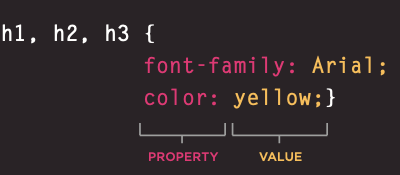

# **The Devil Wears CSS**

## **Food For Thought**
+ It is generally considered good practice to have the content of the site separated from the rules that determine how it appears  
+ You do not need lots of computers to test your site, as there are online tools to show you what a page looks like in multiple browsers:
    1. [BrowserCam](https://www.browsercam.com/)  
    2. [CrossBrowserTesting](https://crossbrowsertesting.com/) 

## **CSS Rules for Days**
+ CSS associates style rules with html elements
+ A CSS rule has two parts **Selector** and **Declaration**
+ **Selector**: indicates which element the rule applies to
+ **Declarations**: indicate how the elements refereed to in the selector should be styled 
+ Declarations have two parts a property and a value that are separated by a colon :  

# **CSS Brace the Elements**
+ CSS properties affect how elements are displayed 
+ CSS declarations sit inside curly brackets and have two parts a **property** and a **value** multiple properties can be specified in on declaration when separated by a semi colon :
+ **Properties**: indicate the aspects of the element you want to change
+ **Values** Specify the settings you want to use for that chosen properties  

## **External CSS**
+ **<link\>**: is the element uses in an html doc to tell the browsers where to find the CSS file used to style the page don't forget it is empty so it doesn't need a closing tag
+ **href**: specifies the path to the css file often put in a css or styles folder
+ **type**:: specifies the type of document being linked to normally a text/css
+ **rel**: specifies the relationship between the HTML page and the file it is linked to this should be a stylesheet when linking to a scss file
+ You can have more than one CSS style sheet you can do this by having a <link\> element for every css file  

## **Internal CSS**
+ **<style\>** is the tag to place an element in for an internal CSS 
+ It should be placed inside the <head\> 
+ It should use the the type of attribute to indicate that the styles are specified in the CSS 
+ If your building a site with more than one page you should use a external CSS style sheet
+ This will allow all the pages to use the same rules rather than having to duplicate them each time
+ Changing the one sheet will change all other linked pages  

## **CSS Selectors**
+ CSS selectors are case sensitive so they must match element names and attribute values exactly
+ More advanced selectors than the ones below will be taught as we go on  
  
  

## **I choose....CSS CASCADE**
+ If two selectors are identical the last rule will take precedence
+ Two selectors of the same kind picked the more specific one will take precedence over the general ones
+ You can add important after any property value to indicate that it should be considered more important than other rules that apply to the same element
+ Understanding how CSS rules cascade means you can write simpler style sheets because you can create generic rules that apply to most elements and then override the properties on individual elements that need to appear differently

## **Grandma left me waht?? A  CSS Inheritance**
+ If you specify the font-family or color properties on the <body\> element, they will apply to most child elements. This is because the value of the font-family property is inherited by child elements. It saves you from having to apply these properties to as many elements (and results in simpler style sheets)  
+ You can force a lot of properties to inherit values from their parent elements by using inherit for the value of the properties. In this example, the <div\> element with a class called page inherits the padding size from the CSS rule that applies to the <body\> element  

# **Summary**
* CSS treats each HTML element as if it appears inside its own box and uses rules to indicate how that element should look  
* Rules are made up of selectors (that specify the elements the rule applies to) and declarations (that indicate what these elements should look like)  
* Different types of selectors allow you to target your rules at different elements  
* Declarations are made up of two parts: the properties of the element that you want to change, and the values of those properties. For example, the font-family property sets the choice of font, and the value arial specifies Arial as the preferred typeface  
* CSS rules usually appear in a separate document, although they may appear within an HTML page  

# **Surf the Website**
- [**Homepage**](README.md)
- [**Markdown**](Markdown.md)  
- [**Fun With Terminal**](Terminal.md)
- [**Git Who**](Git.md)
- [**HTML**](HTML.md)
<!-- DrP E-Sign Up, Up, Down, Down, Left, Right, Left, Right, B, A, Start -->