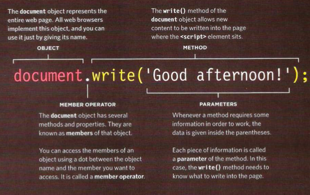
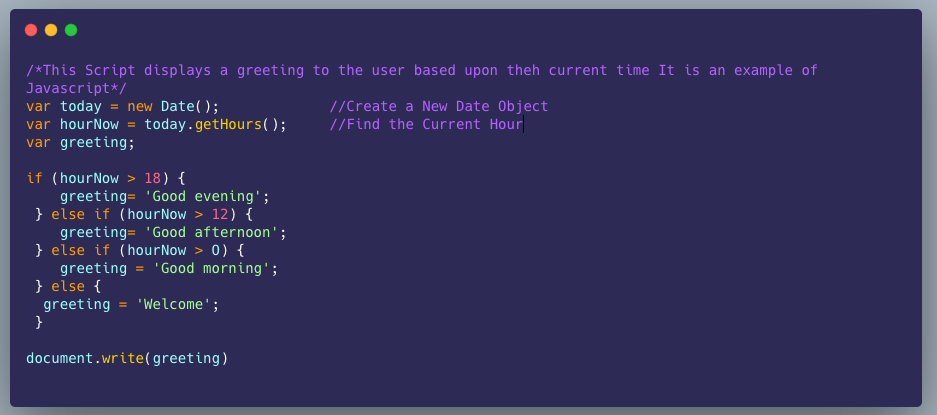

# **Bring me the Script: HTML CSS & Javascript a Match made in Heaven**

## **Food for thought**
+ () is 
+ {} anything inside is called a code block 
+ // is used to mark a note
+ cmd + ? will comment out a section in java

# **How it fits together**
+ **Javascript**: Also spelled JS 
+ Aim to keep HTML CSS and JS in separate files with the HTML files linking to the CSS and JS
+ **Content Layer**: This is going to be where the content lives it gives page structure and adds semantics 
 .HTML files makes up this layer  
+ **Presentation Layer**: .CSS files live here they use CSS to enhance the HTML pages with rules that state how the HTML content is presented (background, border, box dimensions, colors, fonts, etc\)
+ **Behavior Layer** .js files live here this changes how the page behaves, adding interactivity. Keep your JS in a separate file

## **Progressive Enhancement**
+ These three layers form the basis of a popular approach to building web pages called progressive enhancement
+ some people browse with JavaScript turned off, so you need to make sure that the page still works for them
+ Starting with the HTML layer allows you to focus on the most important thing about your site: its content
+ **HTML ONLY**: Being plain HTML, this layer should work on all kinds of devices, be accessible to all users, and load quite quickly on slow connections
+ **HTML+CSS**: Adding the CSS in a separate file keeps the rules for the how the page looks away from the content itself
+ You can have one style sheet per site or multiple that create different views of the same data
+ **HTML+CSS+JavaScript**: JS is the last piece added it enhances the usability of the page or the experience of interacting with the site
+ Keeping it separate means that the page still works if the user cannot load or run the JavaScript. You can also reuse the code on several pages (making the site faster to load and easier to maintain\)

## **Objects, Methods, and Bears......Oh My!!**
+ The below line of code shows how to use objects and methods normally referred to as calling a method of an object  
  
+ Behind the scenes the browser uses a lot more code ot make the words appear not important for what we a doing but good to know
+ You only need to know how to call the object and method and how to tell it the information it needs to do the job it will handle the rest Computer are Cool! 
+ There are lots of objects like the document object above and lots of methods like the wirte(\) method above that can help you write scripts

## **Run Java Run**
+ JS runs where it is found the HTML 
+ When the browser comes across a <script\> element, it stops to load the script and then checks to see if it needs to do anything.  
  
+ In the above example you could move the script and it would change the positions of what it is scripting  

# **Summary**
+ It is best to keep JavaScript code in its own JavaScript file. JavaScript files are text files (like HTML pages and CSS style sheets), but they have the .js extension  
+ The HTML <script\> element is used in HTML pages to tell the browser to load the JavaScript file (rather like the <link\> element can be used to load a CSS file)
+ If you view the source code of the page in the browser, the JavaScript will not have changed the HTML, because the script works with the model of the web page that the browser has created

# **Captain JavaScript has.....Basic JS Instructions**

## **I have a Statement from Captain JavaScript..**;
+ A script is a series of instructions that your computer follows one by one
+ Each individual instruction is know as a **Statement** 
+ Statements should end with a semicolon ;  

+ Lines 1-3 6,8,,10,12,& 14 are all statements
+ These {\} braces indicate the start and end of a code block. Each code block could contain many more statements 
+ Lines 5,7,9,11 determines which code should be run
+ Javascript is case sensitive hourNow and hournow are different 
+ Statements are instructions and each one starts on a new one and ends with a semicolon ;
+ This formatting makes your code easier to read
+ The semicolon tells the JS interpreter when a step is over and when it should move to the next one 
+ Statements cane be organized into code blocks 
+ statements can be surrounded by curley braces {\} this is a code block 
+ The closing curly brace is not followed by a semicolon ;
+ Code blocks will often be used to group together many more statements
+ This makes your code organized and more readable remember your code should be able to be read by anyone that understand JS HTML and CSS after this 

## **Conqueror of the Supreme Comments**
+ Write comments to explain what your code does. it makes it easier to read and understand and can help you and other who read it down the road
+ Multi-line comments are written by starting the line with /* and ends with */ anything written inside of that is not processed by the JS interpreter
+ Normally they are used for descriptions of how the script works or to prevent a section of the script from running when testing it  

## **Variable Vinsmoke Appears**
+ A script will have to temporarily store the bits of information it needs to do its job. It can store this data in variables
+ When you write JavaScript, you have to tell the interpreter every individual step that you want it to perform. This sometimes involves more detail than you might expect
+ You can compare variables to short-term memory, because once you leave the page, the browser will forget any information it holds
+ A variable is a good name for this concept because the data stored in a variable can change (or vary) each time a script runs
+ variables can be used to represent values in your scripts that are likely to change. The result is said to be **calculated** or **computed** using the data stored in the variables
+ The use of variables to represent numbers or other kinds of data is very similar to the concept of algebra (where letters are used to represent numbers\). The equals sign does something very different in programming 

## **Variable Vinsomke will you declare them?**
+ Before you can use a variable you need to announce that you want to use it
+ This involves creating the variable then giving it a name normally you say that you declare the variable  
