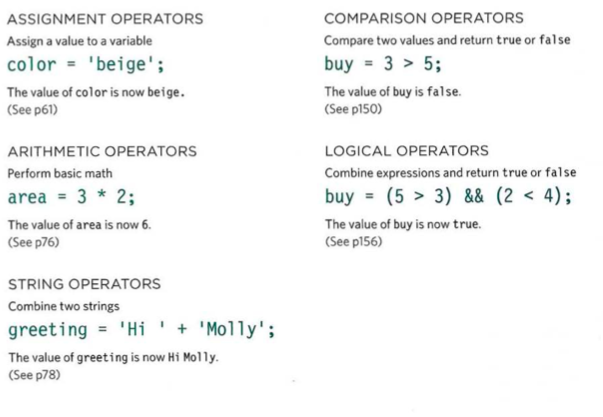
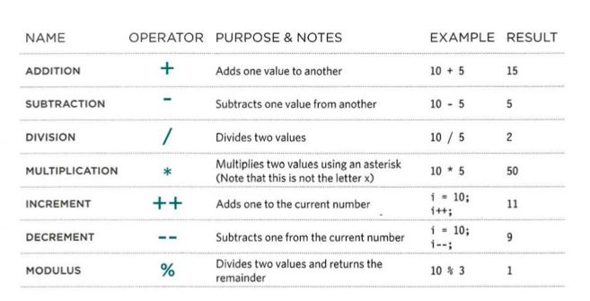
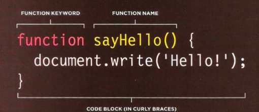
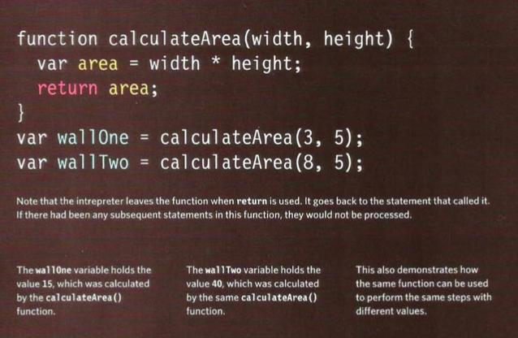

# **Yonko of the Web Javascript Appears**
+  You can use JavaScript to select any element, attribute, or text from an HTML page
+  You can use JavaScript to add elements, attributes, and text to the page, or remove them.
+ You can specify a set of steps for the browser to follow (like a recipe), which allows it to access or change the content of a page
+  You can specify that a script should run when a specific event has occurred
+  Access the content of the page
+  Modify the content of the page
+  Program rules or instructions the browser can follow 
+  React to events triggered by the user or browser
+  Each version of a web browser adds new features. Often these new features make tasks easier, or are considered better, than using older techniques
+ Website visitors do not always keep up with the latest browser releases, so website developers cannot always rely upon the latest technologies

# **Yonko JavaScript gets back to basics**
+ Humans can achieve complex goals without thinking about them too much
+ script is just a series of short instructions, each of which is performed in order
to solve the problem in hand
+  A computer doesn't learn how to perform tasks like you or I might; it needs to follow instructions every time it performs the task
+  Start with the big picture of what you want to achieve, and break that down into smaller steps
   1. Define the Goal 
   2. Design the Script: To design a script you split the goal out into a series of tasks that are going to be involved in solving this puzzle
   3. Code each step: Each of the steps needs to be written in a programming language that the compu ter understand 
+ Once you know the goal of your your script you can work out the individual tasks needed to achieve this
+ Computers solve problems programmatically
+  A script is a series of instructions that the computer can follow in order to achieve a goal.
+ Each time the script runs, it might only use a subset of all the instructions.
+ Computers approach tasks in a different way than humans, so your instructions must let the computer solve the task programmatically.
+ To approach writing a script, break down your goal into a series of tasks and then work out each step needed to complete that task (a flowchart can help).

## **Be Careful Yonko JavaScript is about to use an Expression**
+ An expression evaluates into (results in) a single value. Broadly speaking there are two types of expressions.  
  1. EXPRESSIONS THAT JUST ASSIGN A VALUE TO A VARIABLE: var color = 'blue';
  2. EXPRESSIONS THAT USE TWO OR MORE VALUES TO RETURN A SINGLE VALUE: var area = 3 * 2;  
  
+ JavaScript contains the following mathematical operators, which you can use with numbers.  

+ Remember please:parenthesis, excuse:exponents my:multiplication dear:divsion aunt:application sally:subtraction  
+ To change the order in which operations are performed, place the calculation you want done first inside parentheses

## **OOO No Yonko JavaScript used a string operator**
+ There is just one string operator: the+ symbol. It is used to join the strings on either side of it
+ There are many occasions where you may need to join two or more strings to create a single value. Programmers call the process of joining together two or more strings to create one new string concatenation
+ When you place quotes around a num~er, it is a string (not a numeric data type\), and you cannot perform addition operations on strings
+ If you try to add a numeric data type to a string, then the number becomes part of the string
+ If you try to use any of the other arithmetic operators on a string, then the value that results is usually a value called NaN. This means "not a number."

## **Yonko Javascript performs a function**
+ Functions let you group a series of statements together to perform a specific task
+ If different parts of a script repeat the same task, you can reuse the function 
+ Grouping together the statements that are required to answer a question or perform a task helps organize your code
+ Statements in a function are not always executed when a page loads, so functions also offer a way to store the steps needed to achieve a task
+ The script can then ask the function to perform all of those steps as and when they are required.
+ For example, you might have a task that you only want to perform if the user clicks on a specific element in the page
+ If you are going to ask the function to perform its task later, you need to give your function a name. That name should describe the task it is performing. When you ask it to perform its task, it is known as calling the function
+ Pieces of information passed to a function are known as parameters
+ When you write a function and you expect it to provide you with an answer, the response is known as a return value

## **Yonko JavaScript performs a functions**
+ To create a function you give it a name and then write teh statements needed to achieve its task inside the curly braces. Also know as function declaration
+ You declare a function using the function keyword
+ You give the function a name sometimes an identifier this is parentheses
+ the statements that perform the task sit in a code block inside curly braces  
  
+ Remember the point of functions is to store the code required to perform a task
+ If different parts of the script need the to perform the same task you can use the same fuction to do so 

## **Yonko JavaScript calls a function**
+ Calling a functions is what you do after declaring it in between curly braces 
+ to run code in the functions you use the function name followed by parentheses
+ You would often say the code calls a function
+ you can call the same function as many times as you want  
Function Name: sayHello(\);

## **Yonko JavaScript needs more information to declare that**
+ Functions sometime need specific ino to perform its task
+ when this is the case you when declaring the function you give it parameters  

+ If a functions needs info to work you indicate what it needs to know in parentheses after the functions name
+ the items inside parentheses are know as parameters inside the function those words act like variable names
+ when you design a script you need to note the ino the function will require in order to perform its task 

## **Yonko Javascript tries to get a single value**
+ Some Functions return information to the code that called them  

## **Surf The Website**
- [**Homepage**](README.md)  
- [**Fun with Terminal**](Terminal.md)
- [**Git Who**](Git.md)
- [**HTML**](HTML.md)
- [**CSS**](css.md)
- [**JavaScript**](javascript.md)
- [**JavaScript pt 2**](yonkojavascript.md)
- [**Computers??**](howcomputerwork.md)
<!-- DrP E-Sign Up, Up, Down, Down, Left, Right, Left, Right, B, A, Start -->
