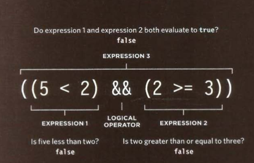
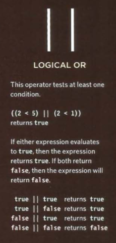
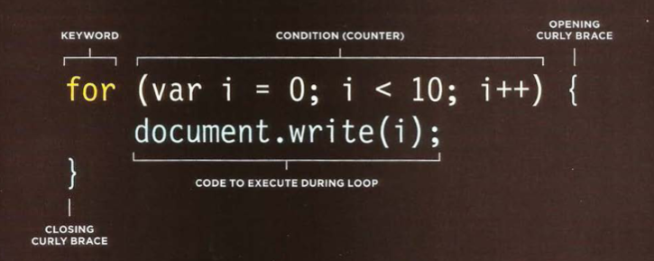

# **Yonko Javscript continues across the web**

## **Yonko JavaScript Food for Thought**
+ Let is an updated version of var
+ A while loop is used to evaluate an expression until we get the desired result 
+ A for loop we have more control over than a while loop
+ (--\) & (++\) can be used in a loop to go down or up by one respectively 

## **Yonko JavaScript, Marine Comparison Operator is trying to Evaluate our ships Conditions**
+ You can evavalute a situation by comparing one value in the script to what you expect it might be
+  This result would be called a Boolean: True or False
+  **==**: Is equal to this **operator** compares two values(numbers, strings, or Booleans) to see if they are the same
+ **'Hello' == 'Goodbye'**: returns false because they are not the same string
+ **'Hello' == 'Goodbye'**: returns turns because they are the same 
+ it is generally preferred to use the strict method below
+ **===**: Strict equal to this operator compares two values to check that both the dat type and value are the same
+ **'3'===3**: returns false because they are not the same data type or value
+ **'3'==='3'**: Returns true because they are the same data type and value
+ **!=**: Is not equal to this operator compares two values: **(numbers, strings or booleans\) to see if they are not the same
+ **'Hello' != 'Goodbye'**: returns true because they are not the same string
+ **'Hello' != 'Hello'**: returns false because they are the same string
+ Again the strict method below is the preferred method
+ **!==**:Strict not equal to this operator compares two values to check that both the date type and value are not the same
+ **"3' !== 3**: returns true because they are not the same
+ **'3" !== '3'**: returns false because they are the same data type and value
+ Programmers often refer to testing or checking of a condition as evaluating the condition
+ Exceptions
  1. Every value can be treated as true or false even if it is not a boolean true or false
  2. in short circuit evaluation a condition might not need to run
+ **>**: Greater Than this operator check if the number on the left is greater than the number on the right
+ **>=**: greater than or equal to this operator checks if the number on the left is greater than or equal to the number on the right
+ **<**: Less than this operator checks if the number on the left is less than the number on the right
+ **<=**: less than or equal to this operator checks if the number on the left is less than or equal to the number on the right

## **Yonko JavaScript, The Marine Admiral Logical Operators appears**
+ Comparison operators usually return single values of true or false Logical operators allow you to compare the results of more than one comparison operator  
  
+ in the above line of code 3 expressions are written
+ the left and the right both use comparison operators and both return false
+ The 3rd uses a logical operator different than a comparison operator
+ This logical AND operator checks to see whether both expressions on either side of it return true 
+ **&&**: Logical AND this operator tests more than one condition  
  
+**||**: Logical OR This operator tests at least one condition  
  
**!**: Logical Not this operator takes a single boolean value and invert it  
  
+ Logical expressions are evaluated left to right
+ if the first condition can provide enough information to get the answer then there is no need to evaluate the second condition

## **Yonko JavaScript Look at for that Loop**
+ Loops check a condition. if it returns true a code block will run
+ Then the conditions is checked again if it is still returns true the code block will run again
+ This repeats until the condition returns false
+ Common Types of Loops
  1. **For**: if you need to run code a specific number of times use a for loop generally the most common loop in these loops the condition is usually a counter which is used to tell how man times the loop should run
  2. **While**: If you do no know how many times the code should run you can use a while loop. IN this loop the condition can be something other than a counter and the code will continue to lop for as long as the condition is true
  3. **DO While**: The do..while loop is very similar to the while loop but one big difference it will always run the statements inside the curly braces at least once even if the condition evaluates to false  
  
+ the above example is a for loop the conditions is a counter that counts to ten the result would write 0123456789
+ if the variable i is less than ten the code inside the curly braces is executed then the counter is incremented 
+ The condition is checked again if i is less than ten it runs again

## **Yonko JavaScript watch out for that Loop Counter**
This all uses the above exmaple but wanted to keep it easy to break up  
+ A for loop uses a counter as a condition
+ This instructs the code to run a specified number of times
+ These conditions are made up of 3 Statements
+ Initialization: create a vaiable and set it to 0 this variable is commonly called i and it acts as the counter ex: **var i = 0;** 
+ The variable is only created the first time a loop is run
+ you can also see this variable declared before the condition
+ Condition: The loop should continue to run until the counter reaches a specified number ex:**i<10;**
+ The value of i was initially set to 0 so in this case the loop will run 10 times before stopping
+ the condition may also use a variable that holds a number 
+ lets say we called a variable rounds and held the number of rounds in a test and the loop ran once for each round the condition would be written as ex: **var round = 3;**  **i <(rounds\)**;
+ **Update**: Every time the loop has run the statements in the curly braces it adds one to the counter ex: **i++**
+ one is added to teh counter using the **increment (++) operator**
+ You can also read this as "Take the Variable i and add one using the ++ operator
+ A loop can also count down using the (--\) decrement operator

# **Surf The Web**
- [**Markdown**](Markdown.md)  
- [**Fun With Terminal**](Terminal.md)
- [**Git Who**](Git.md)
- [**HTML**](HTML.md)
- [**CSS**](css.md)
- [**JavaScript**](javascript.md)
- [**JavaScript pt 2**](yonkojavascript.md)
- [**Computers??**](howcomputerwork.md)
<!-- DrP E-Sign Up, Up, Down, Down, Left, Right, Left, Right, B, A, Start -->
